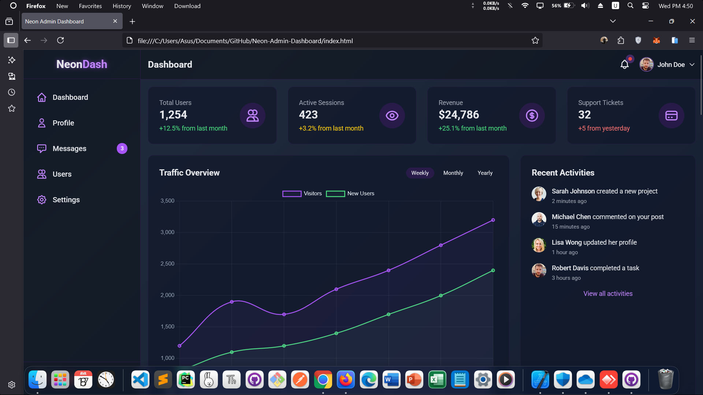

<!-- README.md -->

  <a href="https://amirhosseingholami-dev.github.io/Neon-Admin-Dashboard/" target="_blank" style="text-decoration: none; color: inherit;">
    
    <h3>Neon Admin Dashboard</h3>
  </a>

  A sleek, responsive admin dashboard with a vibrant neon aesthetic.  
  Built with Tailwind CSS, Chart.js, and vanilla JavaScript—no frameworks.  
  Includes user management, real-time messaging, profile editing, analytics charts, settings panels, and a fully interactive UI with dark glassmorphism effects.

  <a href="https://amirhosseingholami-dev.github.io/Neon-Admin-Dashboard/" target="_blank">🎯 Live demo</a> ·
  <a href="https://github.com/AmirHosseinGholami-DEV/Neon-Admin-Dashboard/" target="_blank">💻 Source</a>

